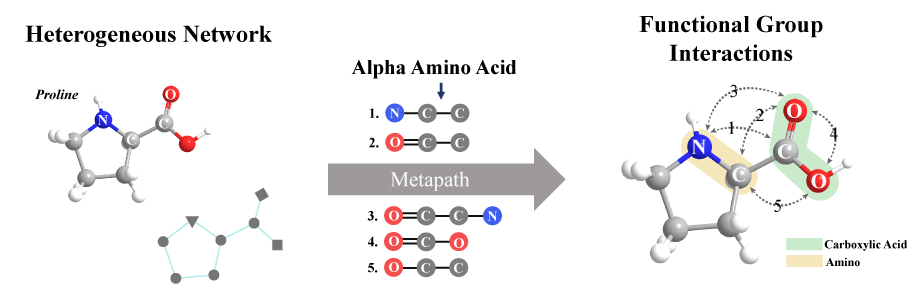
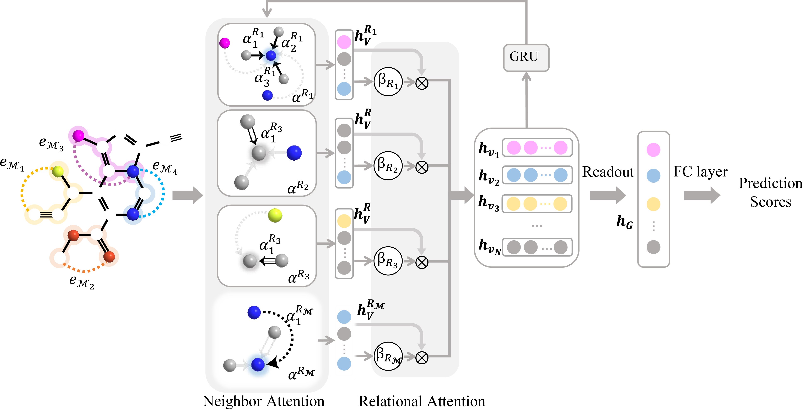

# Metapath-Fused Heterogeneous Graph Network for Molecular Property Prediction

## Brief Introduction

 We propose to model a molecular as a heterogeneous graph and leverage metapaths to capture latent feature for chemical functional groups. To preserve the chemical environments revealed by metapaths, we construct metapath-based connectivity and decompose the heterogeneous graph into subgraphs according to relation types. Besides, a hierarchical attention strategy is designed to aggregate heterogeneous information at node-level and relation-level. Consequently, our approach is more natural and suitable for learning the complex interactions among atomic nodes and effective molecular fingerprints. 
 - Metapath
 
 - Model architecture
  

## Environment Requirement

Our code is written in Python3.6.13. The required packages are listed in “requirements.txt”, including

- pytorch == 1.8.1
- pytorch_geometric == 1.7.2
- numpy ==1.19.2
- rdkit == 2021.03.3

## How to run

- Datasets
  - QM9: Quantum mechanic property
  - ZINC: Molecular solubility
  - ESOL: Molecular solubility
  - Lipophilicity: Molecular lipophilicity
  - PTC: Carcinogenicity
  - MUTAG:Human Tumor Inhibition
  - OGB-molhib: HIV Inhibition
  - OGB-molpacba: Biological Activitiy
  
- Search Metapath
  First, serch metapaths from QM9 and ZINC. Please run and see Search_Metapath.ipynb
- Then train MPMol on QM9 for predicting dipolemoment.

```
python src/main.py --model mpmol --dim 64 --epoch 200 --t 0
```
 Running results:
```
mean:2.6730,std:1.5035
Epoch: 001, LR: 0.001000, Loss: 0.4220750, Val MAE: 0.5018868, Test MAE: 0.5001504, Test stdMAE: 0.3326619
Epoch: 002, LR: 0.001000, Loss: 0.1993716, Val MAE: 0.4187411, Test MAE: 0.4127209, Test stdMAE: 0.2745105
Epoch: 003, LR: 0.001000, Loss: 0.1318186, Val MAE: 0.3662440, Test MAE: 0.3608983, Test stdMAE: 0.2400421
Epoch: 004, LR: 0.001000, Loss: 0.0926693, Val MAE: 0.2856885, Test MAE: 0.2846882, Test stdMAE: 0.1893529
Epoch: 005, LR: 0.001000, Loss: 0.0689662, Val MAE: 0.2552543, Test MAE: 0.2562568, Test stdMAE: 0.1704425
Epoch: 006, LR: 0.001000, Loss: 0.0548217, Val MAE: 0.2303074, Test MAE: 0.2319770, Test stdMAE: 0.1542935
Epoch: 007, LR: 0.001000, Loss: 0.0486509, Val MAE: 0.2028876, Test MAE: 0.2072666, Test stdMAE: 0.1378580
...
Epoch: 200, LR: 0.000028, Loss: 0.0013750, Val MAE: 0.
```
